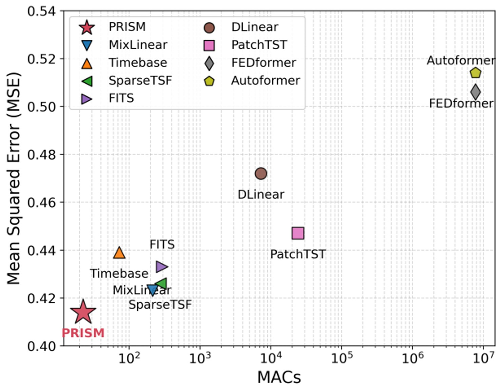
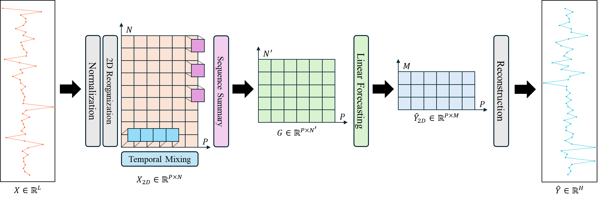
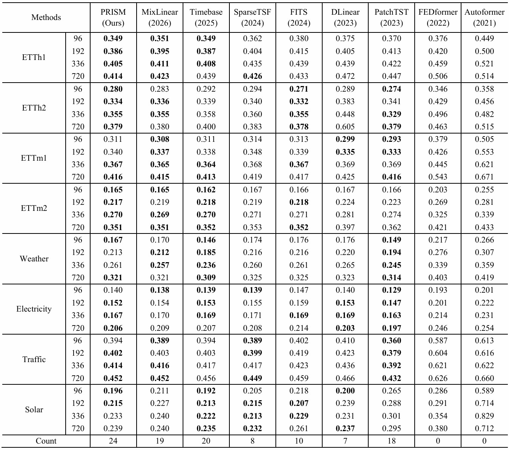
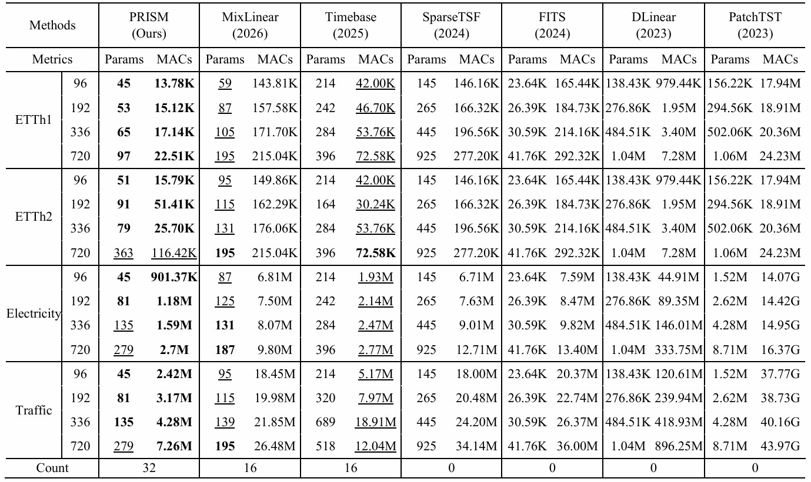
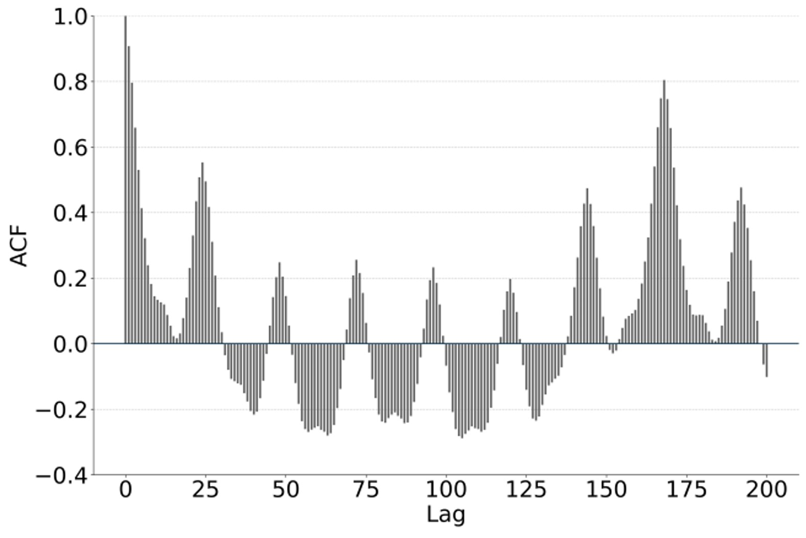
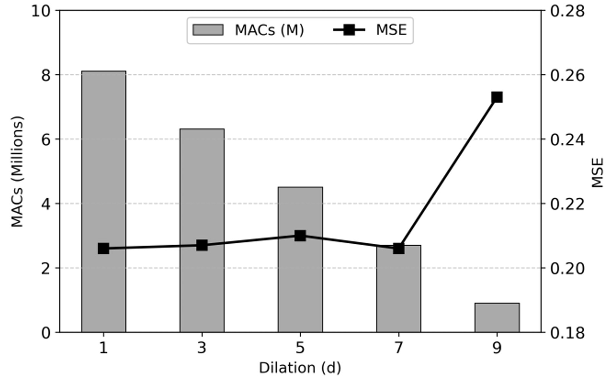
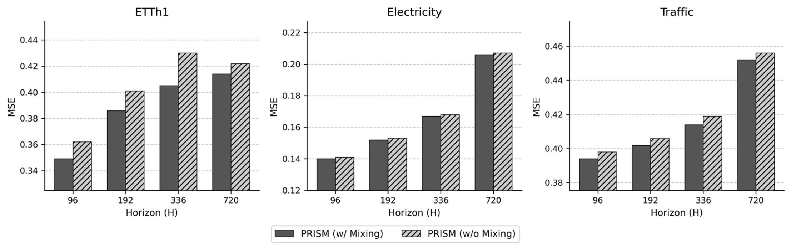
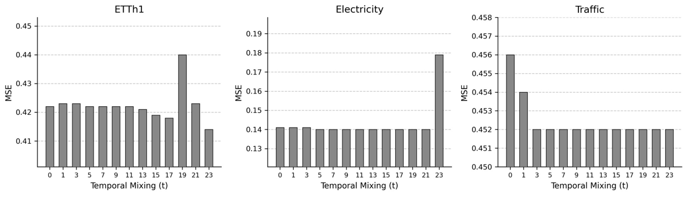

<div align="center">
  <h2>
    <b>PRISM: Lightweight Long-Term Time Series Forecasting With Period-Based Reorganization and Dual-Axis Convolution</b>
  </h2>
</div>

<div align="center">


</div>

This repository provides the PyTorch implementation accompanying our submitted manuscript:

> **PRISM: Lightweight Long-Term Time Series Forecasting With Period-Based Reorganization and Dual-Axis Convolution**

PRISM stands for **Period Reorganization With Intra-Period Sequence Mixing**.

> **Manuscript status:** Submitted and not yet published.
> The repository and experimental results may be updated during the review process.


## 🔍 Overview

PRISM is a lightweight framework for long-term time series forecasting designed for resource-constrained environments.

Existing minimalist forecasting models primarily rely on linear projections. Although computationally efficient, linear projections do not exploit local temporal patterns through shared weights and require parameters proportional to their input and output dimensions.

PRISM addresses this limitation through a **dual-axis convolutional architecture**:

* **Period-based reorganization** transforms a one-dimensional sequence into a two-dimensional periodic representation.
* **Sequence summarization** applies dilated Conv1d across periods to efficiently capture long-range cross-period patterns.
* **Temporal mixing** applies circular-padded Conv1d within each period to learn correlations among temporal phases.
* **Lightweight forecasting** uses a single linear layer to map the extracted representation to the forecasting horizon.
* **ACF-guided configuration** connects the temporal characteristics of each dataset to interpretable hyperparameter choices.

<p align="center">
  
</p>

PRISM establishes a favorable efficiency–accuracy operating point by maintaining competitive forecasting performance with an extremely small parameter count and computational cost.


## 🏗️ Model Architecture

<p align="center">
  
</p>

The PRISM forecasting pipeline consists of five primary stages:

1. **Instance normalization** removes the temporal mean from each input sequence.
2. **2D reorganization** reshapes the sequence according to its known period.
3. **Sequence summarization** applies dilated Conv1d along the cross-period axis.
4. **Temporal mixing** applies circular-padded Conv1d along the intra-period axis.
5. **Linear forecasting and reconstruction** generate and restore the final one-dimensional forecast.

The complete model is implemented in [`models/PRISM.py`](./models/PRISM.py).

### Sequence Summarization

Observations with the same phase across consecutive periods are processed using dilated Conv1d. Kernel size, stride, and dilation jointly determine the receptive field and compression ratio.

This operation captures long-range cross-period dependencies while requiring only a small convolution kernel rather than a dense linear projection.

### Temporal Mixing

Circular-padded Conv1d is applied across the temporal phases within each period.

Circular padding preserves continuity between the final phase of one period and the initial phase of the next period, allowing PRISM to model the cyclic structure of periodic time series without introducing artificial boundary discontinuities.


## 📊 Experimental Results

### Forecasting Performance
PRISM achieves top-three forecasting performance in **24 of 32 evaluation settings**. It ranks first across all forecasting horizons on ETTh1 and maintains top-three performance across all horizons on ETTh2 and ETTm2.

The model also remains competitive on high-dimensional datasets such as Electricity and Traffic while using substantially fewer computational resources than Transformer-based forecasting models.

<p align="center">
  
</p>


### Parameter and Computational Efficiency
PRISM achieves top-two performance in parameter count and MACs across most evaluated settings.

Under the representative configuration with an input length of 720 and a forecasting horizon of 96, PRISM requires only **45 parameters** and **13.78K MACs**.

For ETTh1 with a forecasting horizon of 720, PRISM reduces MACs by approximately:

These results demonstrate that PRISM provides balanced efficiency in both model size and computational cost rather than optimizing only one of these dimensions.

<p align="center">
  
</p>


## 🔬 ACF-Guided Hyperparameter Analysis
PRISM uses the autocorrelation function to interpret the temporal structure of a dataset and guide the selection of its primary hyperparameters:

* `kernel_size` determines how many periods are summarized by each convolution.
* `stride` controls the compression ratio of cross-period features.
* `dilation` determines the receptive field across periods.
* `temporal_kernel_size` controls the range of intra-period temporal interactions.

Datasets with sustained periodicity can benefit from a larger dilation, whereas datasets with rapidly decaying autocorrelation generally favor a more moderate receptive field.

<p align="center">
  
</p>

### Dilation Analysis
Increasing dilation expands the cross-period receptive field while reducing MACs. However, an excessively large dilation can skip important local relationships and degrade forecasting accuracy.

On the Electricity dataset, the forecasting error remains stable up to a moderate dilation value before increasing sharply, demonstrating the importance of balancing computational efficiency and temporal coverage.

<p align="center">
  
</p>


## 🔄 Effect of Temporal Mixing
Temporal mixing consistently improves forecasting performance on ETTh1 and provides smaller but meaningful improvements on Traffic.

Its effect is limited on Electricity, whose rapidly decaying intra-period autocorrelation provides less temporal structure for the mixing operation to exploit. Across the evaluated datasets, temporal mixing contributes either positively or neutrally and does not degrade performance.

<p align="center">
  
</p>


### Temporal Mixing Kernel Size
The optimal temporal mixing kernel size depends on the strength and range of intra-period correlations.

Larger kernels can capture broader phase interactions in strongly periodic data, but they may introduce noise or destructive interactions when intra-period dependencies are weak. This result further supports configuring PRISM according to the temporal characteristics observed through ACF analysis.

<p align="center">
  
</p>


## 🚀 Getting Started

### 1. Clone the repository

```bash
git clone https://github.com/Pigeon1999/PRISM.git
cd PRISM
```

### 2. Create a Conda environment

```bash
conda create -n prism python=3.8.20 -y
conda activate prism
```

### 3. Install dependencies

```bash
pip install -r requirements.txt
```


## 📦 Dataset Preparation

The datasets are not included in this repository.

Create a `Dataset` directory in the project root:

```bash
mkdir Dataset
```

Place the required CSV files in the following directory:

```text
PRISM/
└── Dataset/
    └── <dataset>.csv
```

The dataset path, forecasting horizon, and PRISM hyperparameters can be configured in [`main.ipynb`](./main.ipynb).


## 📝 Manuscript Status

This work has been submitted and is not yet published.

A public manuscript link, publication information, and BibTeX citation will be added after publication.
