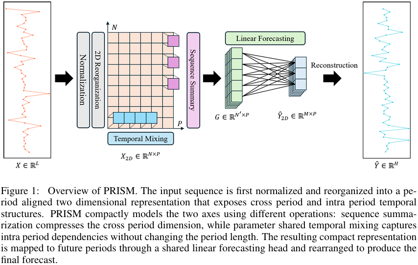
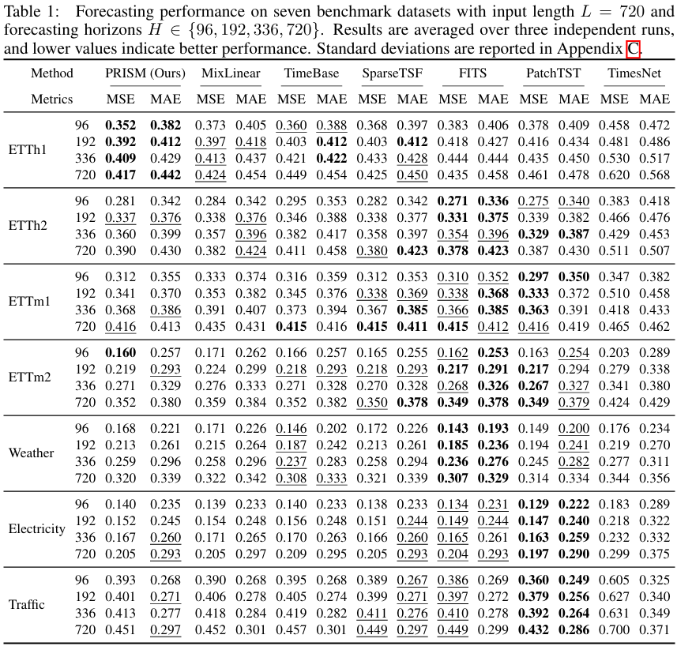
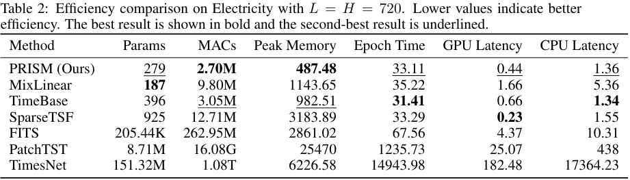
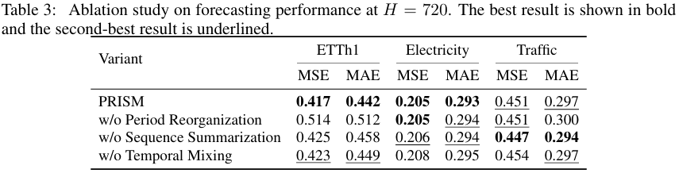
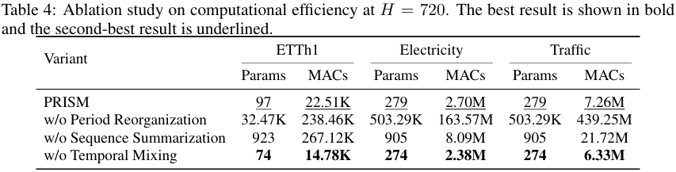

<div align="center">
  <h2>
    <b>PRISM: Lightweight Long-Term Time Series Forecasting with Period-Aligned Summarization</b>
  </h2>
</div>

<div align="center">


</div>

This repository provides the PyTorch implementation accompanying our submitted manuscript:

> **PRISM: Lightweight Long-Term Time Series Forecasting with Period-Aligned Summarization**

> **Manuscript status:** Submitted and not yet published.  
> The repository and experimental results may be updated during the review process.


## 🔍 Overview

PRISM is a lightweight framework for long-term time series forecasting designed to balance forecasting accuracy and computational efficiency.

PRISM exploits periodic structure as a **computational prior** by reorganizing the input sequence into a period-aligned representation with cross-period and intra-period temporal axes.

Rather than applying the same computation to both axes, PRISM assigns them asymmetric computational roles:

* **Period reorganization** transforms the one-dimensional sequence into a two-dimensional period-aligned representation.
* **Sequence summarization** compresses the cross-period dimension before forecasting.
* **Temporal mixing** refines dependencies along the intra-period dimension using a lightweight shared convolution.
* **Lightweight forecasting** maps the compact representation to future periods using a shared linear layer.

The central design principle of PRISM lies not in the use of convolution itself, but in the asymmetric organization of computation across the two temporal axes.

<p align="center">
  
</p>

PRISM performs forecasting from a compact period-aligned representation, allowing the forecasting head to avoid operating directly on the full historical sequence.


## 🏗️ Model Architecture

The PRISM forecasting pipeline consists of five primary stages:

1. **Instance normalization** removes the temporal mean from each input sequence.
2. **Period reorganization** reshapes the sequence into a period-aligned two-dimensional representation.
3. **Sequence summarization** applies dilated Conv1d along the cross-period axis to compress historical information.
4. **Temporal mixing** applies circular-padded Conv1d along the intra-period axis.
5. **Linear forecasting and reconstruction** map the compact representation to future periods and reconstruct the final one-dimensional forecast.

The complete model is implemented in [`models/PRISM.py`](./models/PRISM.py).

### Sequence Summarization

After period reorganization, the input is organized so that observations occupying the same position in different periods are aligned along the cross-period axis.

Sequence summarization applies a shared dilated one-dimensional convolution along this axis. Kernel size, stride, and dilation control how much historical information is covered and how strongly the representation is compressed.

This stage performs the primary dimensional reduction in PRISM. By reducing the cross-period dimension before forecasting, the forecasting head operates on a compact representation rather than the full historical sequence.

### Temporal Mixing

Temporal mixing operates along the intra-period axis after cross-period summarization.

PRISM applies a shared one-dimensional convolution with circular padding so that temporal positions near the beginning and end of each period can interact naturally.

Because the same kernel is reused across summarized cross-period features, temporal mixing introduces only a small number of additional parameters while modeling complementary intra-period structure.


## 📊 Experimental Results

### Forecasting Performance

PRISM is evaluated on seven widely used long-term time series forecasting benchmarks:

* ETTh1
* ETTh2
* ETTm1
* ETTm2
* Weather
* Electricity
* Traffic

All forecasting experiments use an input length of 720 and evaluate four forecasting horizons:

* 96
* 192
* 336
* 720

PRISM is compared with MixLinear, TimeBase, SparseTSF, FITS, PatchTST, and TimesNet using MSE and MAE.

Across the evaluated settings, PRISM maintains competitive forecasting performance while using a highly compact architecture. In particular, PRISM performs strongly on ETTh1 and remains competitive with recent lightweight forecasting models across multiple datasets and forecasting horizons.

<p align="center">
  
</p>


### Parameter and Computational Efficiency

PRISM is designed to reduce computation before the forecasting stage rather than relying on a large forecasting head.

Its parameter count is determined by three compact components:

* the sequence summarization kernel,
* the temporal mixing kernel,
* and the shared forecasting layer.

The computational cost grows with the compressed cross-period representation rather than the original historical representation. As a result, sequence summarization directly reduces the cost of the forecasting head.

A detailed practical efficiency comparison is conducted on Electricity with an input length and forecasting horizon of 720.

Under this setting, PRISM requires only:

* **279 trainable parameters**
* **2.70M MACs**
* **487.48 peak memory**
* **0.44 ms GPU inference latency**
* **1.36 ms CPU inference latency**

Compared with TimeBase, PRISM reduces MACs by approximately **11.5%** and peak memory usage by approximately **50.4%**.

<p align="center">
  
</p>

These results indicate that PRISM provides a favorable balance across parameter count, computational cost, memory usage, and practical inference efficiency rather than optimizing only a single efficiency metric.


## 🔬 Ablation Study

We evaluate the contribution of the three primary components of PRISM on ETTh1, Electricity, and Traffic at a forecasting horizon of 720.

The evaluated variants are:

* **PRISM**
* **w/o Period Reorganization**
* **w/o Sequence Summarization**
* **w/o Temporal Mixing**

### Forecasting Performance

<p align="center">
  
</p>

Removing period reorganization substantially degrades forecasting performance on ETTh1, while removing temporal mixing generally results in comparable or worse accuracy.

Sequence summarization plays an especially important role because it reduces the representation size before forecasting while maintaining competitive predictive performance.


### Computational Efficiency

<p align="center">
  
</p>

Removing sequence summarization substantially increases computational cost because the forecasting head must operate on the original cross-period representation rather than the compressed one.

For example, on Traffic, sequence summarization reduces computation from **21.72M MACs to 7.26M MACs**, corresponding to approximately a **66.6% reduction**.

Temporal mixing contributes relatively little additional computation while generally improving or preserving forecasting accuracy.


## 🔄 Sensitivity to Period Selection

PRISM relies on a predefined period length to construct the period-aligned representation.

The period length determines the alignment granularity of the representation and serves as a structural prior. It is not required to exactly match a dominant physical or seasonal period.

To examine sensitivity to this prior, we vary the period length on ETTh1 and Weather while keeping the remaining architectural configuration fixed.

<p align="center">
  
</p>

The effect of period selection is dataset-dependent.

ETTh1 is more sensitive to particular period choices, although several alternative values remain comparable to the default setting. Weather exhibits a smoother response and remains relatively stable across a broader range of period values.

These results indicate that an appropriate alignment granularity can be important, while the degree of sensitivity varies across datasets.


## 🚀 Getting Started

### 1. Clone the repository

```bash
git clone <anonymous-repository-url>
cd PRISM
```

### 2. Create a Conda environment

```bash
conda create -n prism python=3.8.20 -y
conda activate prism
```

### 3. Install dependencies

```bash
pip install -r requirements.txt
```


## 📦 Dataset Preparation

The datasets are not included in this repository.

Create a `Dataset` directory in the project root:

```bash
mkdir Dataset
```

Place the required CSV files in the following directory:

```text
PRISM/
└── Dataset/
    └── <dataset>.csv
```

The experiments use the following seven datasets:

```text
ETTh1
ETTh2
ETTm1
ETTm2
Weather
Electricity
Traffic
```

The dataset path, forecasting horizon, and PRISM hyperparameters can be configured in [`main.ipynb`](./main.ipynb).


## 📝 Manuscript Status

This work has been submitted and is not yet published.

The repository is provided for anonymous review and reproducibility.

A public manuscript link, publication information, and BibTeX citation will be added after publication.
